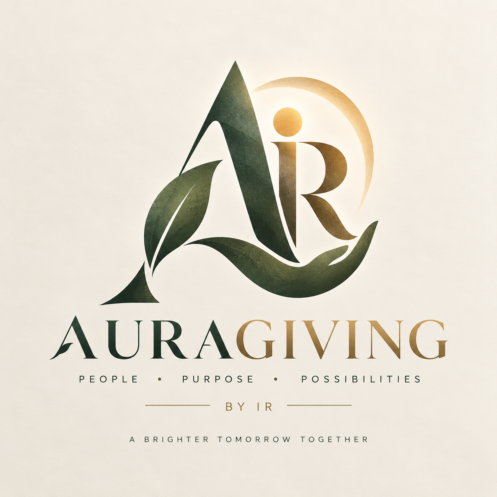

<p align="center">
  
</p>

<p align="center">
  
</p>

<p align="center">
  
</p>

<h2 align="center">💚 Zero-Deduction Non-Custodial Web3 Philanthropy Protocol.</h2>

<p align="center">
  
  
  
  
</p>

---
> *"Decentralized, non-custodial Web3 philanthropy protocol on Ethereum."*  
> **AuraGiving** is a transparent, zero-deduction charity donation platform built on Ethereum.  
> Designed with **Solidity 0.8.9**, **React 18**, **Framer Motion**, **Lenis**, and **Tailwind CSS** to route 100% of donor contributions directly to verified humanitarian and educational causes.

---

# ✨ Features

- 💚 **100% Direct Giving** — Zero middleman cuts or administrative platform deductions.
- 🤝 **Non-Custodial Escrow** — Smart contracts route funds instantly to recipient wallets without intermediate holding.
- ⚡ **Momentum Smooth Scroll & Motion** — Powered by Lenis smooth scrolling, Framer Motion page transitions, and confetti animations.
- 💸 **Quick Donate Modal** — One-click preset donation buttons (0.01, 0.05, 0.1 ETH) with custom input fields.
- 📖 **Interactive Protocol Guides** — Built-in "How It Works" and "Tutorial" modal walkthroughs for onboarding new Web3 donors.
- 🌙 **Dual Theme Support** — Cool marble light mode & dark midnight aesthetic with crisp typography.
- 🔍 **Real-Time Cause Explorer** — Search humanitarian campaigns, track progress towards targets, and inspect donor addresses.

---

# 💡 Why This Project?

This platform demonstrates:

- **Non-Profit Web3 Engineering**: Removing third-party transaction fees to maximize real-world impact.
- **Polished UI Engineering**: Modal overlays, toast notifications, interactive spotlight cursor glow, and live progress bars.
- **Audited On-Chain Records**: Transparent donor logs for full public verification.

---

# 🧩 Tech Stack

| Layer | Technology |
|-------|-----------|
| Smart Contract | Solidity `^0.8.9`, Hardhat |
| Client | React 18, Vite 3, Tailwind CSS 3, Ethers.js 5 |
| Motion & Polish | Framer Motion 10.18, Lenis 1.3, Canvas Confetti |
| Design System | Lucide React Icons, Custom State Context |

---

# 📂 Project Structure

```plaintext
Charity Donation Platform/Charity-Donation-Blockchain-System-main/
├── web3/
│   ├── contracts/
│   │   └── CrowdFunding.sol    # Core Solidity Philanthropy Contract
│   ├── hardhat.config.js
│   └── scripts/
│       └── deploy.js           # Contract deployment script
├── client/
│   ├── public/
│   │   └── AURAGIVING_LOGO.png # Official AuraGiving Brand Asset
│   ├── src/
│   │   ├── components/         # Navbar, Footer, Hero, CampaignCard, QuickDonateModal, etc.
│   │   ├── context/            # Web3 Context state provider
│   │   ├── pages/              # Home, CreateCampaign, CampaignDetails, Profile
│   │   ├── config/             # Contract addresses & ABIs
│   │   ├── index.css           # Global Tailwind styles & light mode rules
│   │   ├── App.jsx             # Main App layout & routes
│   │   └── main.jsx            # Entry point
│   ├── index.html
│   └── package.json
└── README.md
```

---

# ⚙️ Installation & Local Setup

### Prerequisites
- Node.js 18+
- MetaMask browser extension

### 1. Install Client Dependencies

```bash
# Clone repository
git clone https://github.com/Cipher-Shadow-IR/AuraGiving-Web3-Charity.git
cd "Charity Donation Platform/Charity-Donation-Blockchain-System-main/client"

# Install node modules
npm install
```

### 2. Run Development Server

```bash
npm run dev
```

Open [http://localhost:5173](http://localhost:5173).

### 3. Build for Production

```bash
npm run build
```

---

# 📬 Smart Contract API Reference

### Contract Methods

| Function | Access | Parameters | Description |
|----------|--------|------------|-------------|
| `createCampaign` | Public | `address _owner, string _title, string _description, uint256 _target, uint256 _deadline, string _image` | Creates a new charity cause |
| `donateToCampaign` | Payable | `uint256 _id` | Routes ETH directly to the cause owner |
| `getDonators` | View | `uint256 _id` | Returns list of donor addresses and amounts |
| `getCampaigns` | View | — | Returns array of all active & completed causes |

---

# 💬 Author

<p align="center">
  <b>Designed & Developed by Ishaan Ray (Cipher Shadow)</b><br>
  <i>"Decentralized, non-custodial Web3 philanthropy protocol on Ethereum."</i><br><br>
  <a href="https://github.com/Cipher-Shadow-IR" target="_blank">
    
  </a>
  <a href="https://linkedin.com/in/ishaan-ray-cs" target="_blank">
    
  </a>
  <a href="https://galaxir.vercel.app/" target="_blank">
    
  </a>
</p>

---

# 📜 License

MIT License © Ishaan Ray
